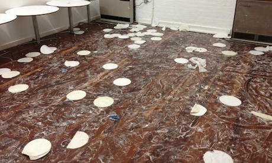

										

  

    

      

        About us
      

    

    

      

        

            
        

      

    

    

      

        <em>The aftermath of a pie fight after showing Bugsy Malone in 2012</em>
        <em> </em>
         Premiering on a chilly February evening in 2010 with Ken Loach&rsquo;s fabulous 
        <em>Looking for Eric,</em>
         Shipley Film Society was the first regular cultural event at a reinvented and reinvigorated Kirkgate Centre in Shipley.  Now part of a vibrant programme at the centre, which includes the likes of the 
        <a href="https://www.facebook.com/FrontRoomDisco" rel="external">Front Room Disco</a>
         and 
        <a href="https://www.facebook.com/goldencabinetuk" rel="external">Golden Cabinet</a>
        , we&rsquo;d like to think Shipley Film Society is, in its own small way, part of what makes Shipley a really great place to live.  You can find out about all the different groups and events at the Kirkgate Centre 
        <a href="http://www.kirkgatecentre.org.uk" rel="external">by clicking here.</a>  All our films are still shown at the Kirkgate Centre, situated in the centre of Shipley and opposite the town hall. The full address is:  Kirkgate Centre 39a Kirkgate  Shipley BD18 3EH  A bar is open before films, serving wines, beers and non-alcoholic drinks, popcorn and cake.  
        Are you sitting comfortably? 
        We love the Kirkgate Centre and we&rsquo;d especially love to see it re-furbished! Until that happens, it can get a little cool in the winter, so bring along a cushion and blanket if you like!  
        Bradford Metropolitan Foodbank 
        We ask everyone who comes to look though your cupboards and bring along some non-perishable food for distribution to those struggling to feed themselves or their family. We really look forward to the day when this is no longer necessary.  
        Get involved 
        The film society is run entirely by volunteers. Please drop us line or chat to us after a film if you&rsquo;d like to get more involved. Membership is simple and free - just join our mailing list!
      

    

  

